# 🚀 Bienvenido al espacio creativo de SkillParty

¡Hola! Somos **SkillParty**, enfocados en construir software y experiencias de alta calidad. 

### 🕹️ Variante Custom Pro: Space Destroyer

  

### ☄️ Variante Auto: Contribution Shooter

  

  <picture>
    <source media="(prefers-color-scheme: dark)" srcset="https://raw.githubusercontent.com/skillparty/skillparty/output/github-contribution-grid-snake-dark.svg" />
    <source media="(prefers-color-scheme: light)" srcset="https://raw.githubusercontent.com/skillparty/skillparty/output/github-contribution-grid-snake.svg" />
    
  </picture>

### 📊 Estadísticas de Código

  
  

---
*Siempre explorando nuevas fronteras en la nube, optimización SEO, App Router de Next.js y ecosistema Flutter.*
